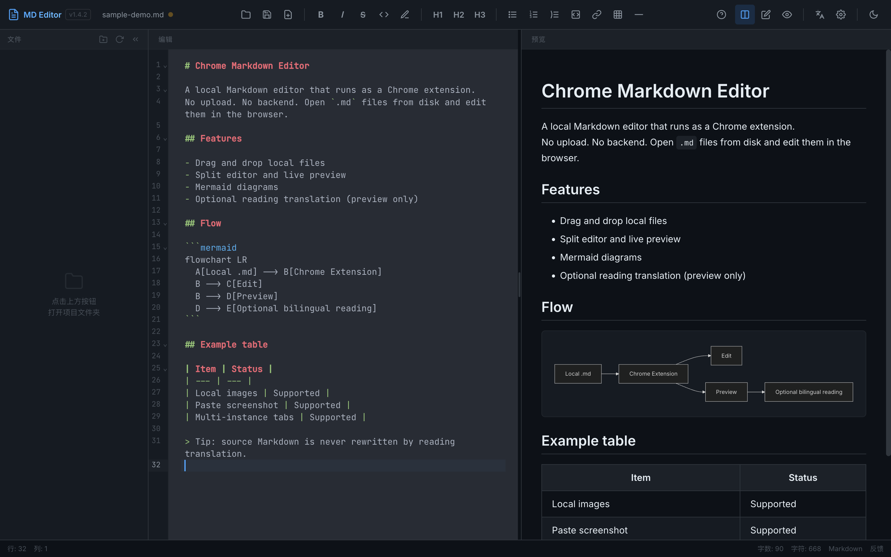
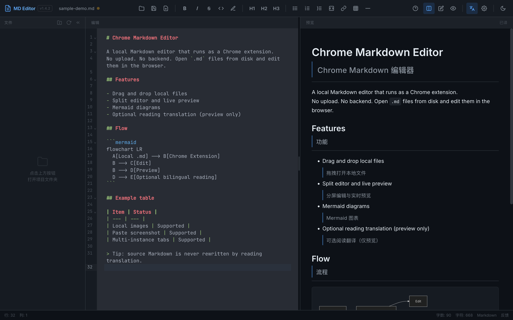
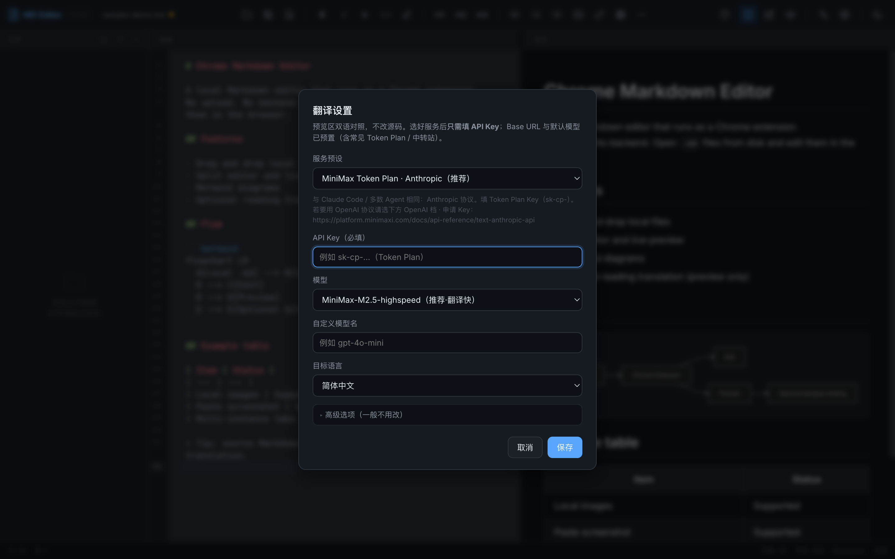
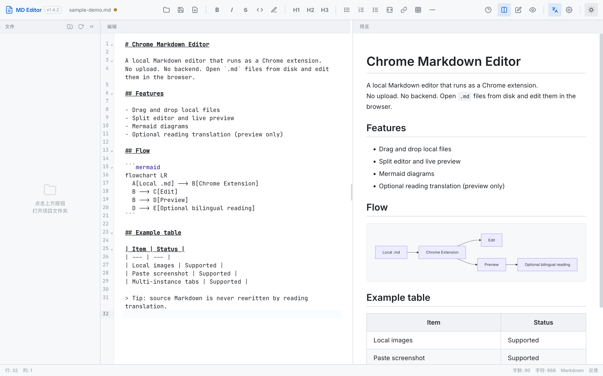
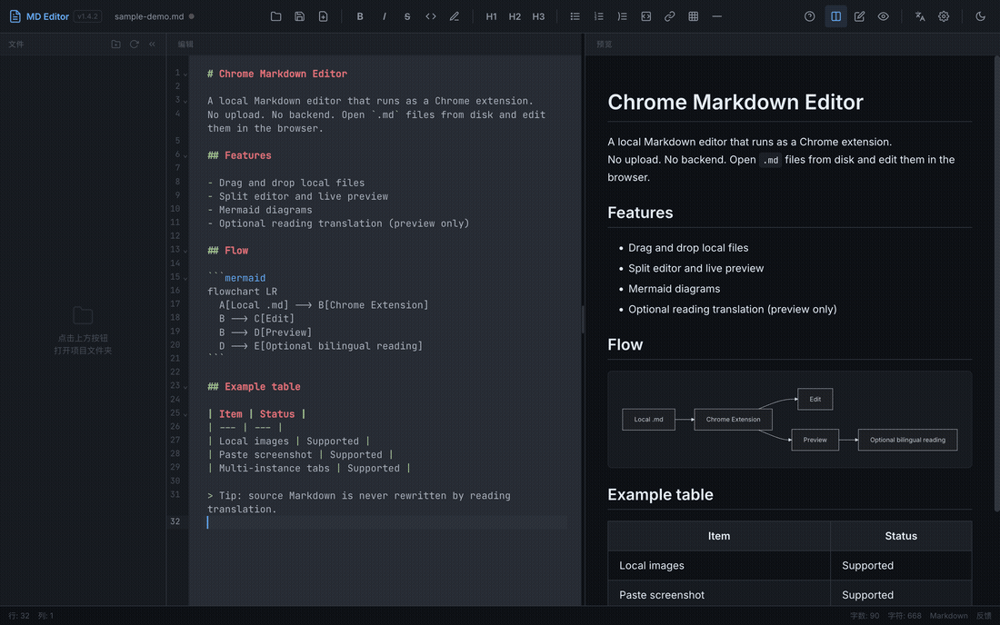

# Chrome Markdown Editor

本地 Markdown 编辑器 Chrome 扩展。
不上传文件、不依赖后端；在浏览器里直接打开、编辑、预览本地 `.md`。

**当前版本：[v1.4.14](https://github.com/zhangweildlh/chrome-md-editor/releases/tag/v1.4.14-desktop)**  
**下载（Chrome 扩展）：** [chrome-md-editor-v1.4.8.zip](https://github.com/zhangweildlh/chrome-md-editor/releases/download/v1.4.8-desktop/chrome-md-editor-v1.4.8.zip)  
**下载（Windows 独立 EXE）：** [Markdown.Editor_1.4.8_portable.exe](https://github.com/zhangweildlh/chrome-md-editor/releases/download/v1.4.8-desktop/Markdown.Editor_1.4.8_portable.exe)  
**许可：** [MIT](./LICENSE)

[English](#english)

---

## 预览

分屏编辑 + 实时预览（深色）：



阅读翻译：预览区中英对照（不改源码）：



翻译设置（选预设 + 粘贴 API Key）：



浅色主题：



动图（主界面 → 设置 → 双语）：



---

## 功能

| 能力 | 说明 |
| --- | --- |
| 拖拽打开 | 将本地 `.md` 拖入 Chrome，扩展接管并打开编辑器 |
| 多实例 | 每次点扩展图标新开独立标签；多文件互不抢占 |
| 项目侧边栏 | 打开文件夹后浏览并切换同目录 Markdown |
| 分屏预览 | 左编辑 / 右预览；支持仅编辑、仅预览 |
| 预览区编辑 | 可在渲染结果上直接改字，再同步回源码（回车新增/删除空段、多段 `>` 引用、滚动位置均正确保持，不会插入多余空行或跳回文件头） |
| 本地图片 | 相对路径图片可预览；支持粘贴截图（有权限时写入 `images/`） |
| 查找 / 替换 | 自绘中文查找替换面板；显示命中位置 `X/Y`、支持全选匹配、替换下一个/全部（替代 CodeMirror 默认英文面板） |
| 粘贴为 Markdown | 从网页/富文本复制内容粘贴时自动转换为 Markdown（保留原有图片粘贴；纯文本与无结构内容原样放行） |
| Mermaid | ` ```mermaid ` 代码块渲染为图 |
| 主题 | 深色 / 浅色 |
| 会话恢复 | 再次打开扩展时尽量恢复上次内容与文件名 |
| 阅读翻译 | 预览区中英对照；**不修改** Markdown 源文件 |

技术栈：CodeMirror 6 · markdown-it · Vite · Manifest V3。  
桌面端额外使用 Rust + Tauri v2 打包为独立 Windows EXE。

---

## 桌面端独立 EXE（Tauri）

除了 Chrome 扩展，本项目还提供一个**独立 Windows 程序**：用 [Tauri](https://tauri.app/) v2 把同一套 Web 编辑器（CodeMirror 6 + markdown-it + Mermaid）打包成绿色免安装的 EXE，**无需浏览器、无需安装、本地零依赖**（仅依赖系统 WebView2 运行时）。

- **下载**：Release `v1.4.8-desktop` 中的 `Markdown.Editor_1.4.8_portable.exe`（便携版，直接拷到任意目录双击运行）。
- **双击打开**：把 `.md` 设为默认打开程序后，双击任意 `.md` 文件即由 EXE 直接打开并编辑。
- **拖入打开**：启动 EXE 后，把 `.md` 文件拖进窗口也能打开。
- **多实例**：每次双击 / 拖入都启动一个独立 EXE 实例，各自打开对应文件，互不干扰。
- **保存写回原文件**：底层用 Rust `std::fs` 命令读写（无路径作用域限制），`Ctrl/Cmd+S` 可直接覆盖原文件。
- **未签名提示**：未签名版本首次运行可能被 Windows SmartScreen 拦截，点「仍要运行」即可；本机需已安装 WebView2 运行时（Win10/11 通常已自带，否则按提示安装）。
- **本地零安装构建**：EXE 完全在 GitHub 云端（`windows-latest`）用 Rust + Tauri 构建；一次打 `v1.4.8-desktop` 标签即**同时产出扩展 zip 与 EXE 两个资产**，开发者本地无需安装 Rust / Tauri / WebView2。

> 桌面端与 Chrome 扩展共用 `src/editor.html/.js/.css`；仅在检测到 Tauri 环境时由 `src/desktop-shims.js` 注入 `chrome` 与 File System Access API 垫片，对扩展零影响。桌面端的具体调试与演进见 [DEVLOG.md](./DEVLOG.md)。

---

## 安装（用户）

1. 打开 [Releases](https://github.com/yishu-ziyu/chrome-md-editor/releases)，下载最新 `chrome-md-editor-v*.zip`。
2. 解压，得到内层 **`dist/`** 目录（不要加载 zip 根目录，也不要加载本仓库源码根目录）。
3. Chrome 打开 `chrome://extensions/`，打开右上角 **开发者模式**。
4. **加载已解压的扩展程序**，选择上一步的 `dist/`。
5. 进入扩展 **详细信息**，开启 **允许访问文件网址**（拖拽本地 `.md` 必需）。
6. 点工具栏扩展图标启动，或把 `.md` 拖进浏览器。

### 从旧版升级

1. 在 `chrome://extensions/` 对该扩展点 **重新加载**。
2. 关掉所有旧的编辑器标签，再新开一页。
3. 确认左上角版本徽标与 Release 一致（当前应为 **v1.4.14**）。
4. 桌面 EXE 用户：重新下载 `Markdown.Editor_1.4.8_portable.exe` 覆盖旧文件即可，无需卸载。

---

## 使用

### 基本编辑

1. 拖入 `.md`，或点扩展图标后「打开文件 / 打开文件夹」。
2. 左侧写 Markdown，右侧实时预览。
3. 需要时可在预览区直接点选改字；失焦后写回源码。
4. `Ctrl/Cmd+S` 保存（首次可能弹出系统保存对话框）。

### 阅读翻译

用于读英文长文，不是用来改写源文件。

1. 点「译」旁的齿轮，选择服务预设。
2. 粘贴 API Key（默认预设为 MiniMax Token Plan · Anthropic，Key 形如 `sk-cp-...`）。
3. 点 **译**：预览区在英文段落下显示中文。
4. 再点一次关闭翻译，预览恢复原文排版。

预设覆盖常见官方接口、国内模型、Token Plan（MiniMax / 阶跃）、聚合与 DeepL。
高级设置可改 Base URL 与模型名。

开启翻译后，文档正文会发往你配置的 API 服务商。
未开启翻译时，编辑与预览均在本地完成。

---

## 开发

需要 Node.js 18+（建议 20+）。

```bash
npm install
npm test          # 单元测试
npm run build     # 输出到 dist/
npm run pack      # build + 打 zip：chrome-md-editor-v<version>.zip
```

加载方式与用户安装相同：在 `chrome://extensions/` 加载本仓库的 **`dist/`**。

```bash
npm run dev       # 仅 UI 调试用；无 chrome.* / 文件 API，不能代替扩展验收
```

改代码后：`npm run build` → 扩展卡片 **重新加载** → 关掉旧标签再测。

相关文档：

- 变更记录：[CHANGELOG.md](./CHANGELOG.md)
- 开发过程：[DEVLOG.md](./DEVLOG.md)

---

## 目录说明

```
public/          # manifest、background、content-script、icons（构建时拷贝进 dist）
src/             # 编辑器页面与逻辑（扩展与桌面端共用）
desktop/         # Tauri v2 桌面壳（Rust + 配置），打包为独立 Windows EXE
tests/           # node:test 单元测试
scripts/         # 打包、图标、验收脚本
docs/images/     # README 截图与演示 GIF
dist/            # 构建产物（gitignore；Chrome 只加载这里）
```

---

## 隐私

- 默认：文件读写在本地完成，不经过本项目服务器（本项目无后端）。
- 阅读翻译：仅在你主动开启并配置 Key 后，将预览中的待译文本发送到你选择的第三方 API。
- API Key 保存在浏览器扩展本地存储中。

---

## License

[MIT](./LICENSE) © 2026 [yishu-ziyu](https://github.com/yishu-ziyu)

---

## English

**Chrome Markdown Editor** is a Manifest V3 extension for editing local Markdown files in the browser.
No backend.
No upload for normal editing.


### Install

1. Download `chrome-md-editor-v*.zip` from [Releases](https://github.com/yishu-ziyu/chrome-md-editor/releases).
2. Unzip and load the inner **`dist/`** folder via `chrome://extensions` (Developer mode → Load unpacked).
3. Enable **Allow access to file URLs** in the extension details.
4. Click the toolbar icon, or drag a `.md` file into Chrome.

After upgrading: **Reload** the extension, close old editor tabs, open a new one.
The toolbar should show the release version (currently **v1.4.14**).

### Features (short)

- Drag-open local `.md`, multi-tab instances, folder sidebar
- Split / editor / preview layouts, light & dark themes
- Preview WYSIWYG sync, Mermaid, local images, paste screenshot
- Optional reading translation (bilingual preview; source file unchanged)

### Develop

```bash
npm install && npm test && npm run build
```

Load `dist/` as an unpacked extension.
`npm run dev` is UI-only and is not a substitute for extension testing.

### Privacy

Editing stays local unless you enable reading translation, which sends text to the API provider you configure.

### Standalone Windows EXE (Tauri)

A portable Windows build is also provided: the same web editor packaged with Tauri v2 into a green, install-free `Markdown.Editor_1.4.8_portable.exe`. Double-clicking a `.md` (after setting it as the default opener) or dragging a `.md` into the window opens it directly; each open runs as an independent instance. Saves write back to the original file. The EXE relies on the system WebView2 runtime and is built entirely in GitHub Actions (no local Rust/Tauri toolchain needed). Download from the `v1.4.8-desktop` release.

### License

[MIT](./LICENSE)
