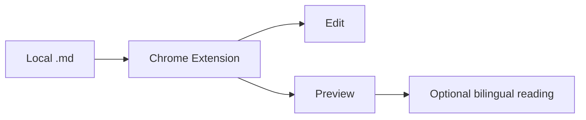

# Chrome Markdown Editor

A local Markdown editor that runs as a Chrome extension.
No upload. No backend. Open `.md` files from disk and edit them in the browser.

## Features

- Drag and drop local files
- Split editor and live preview
- Mermaid diagrams
- Optional reading translation (preview only)

## Flow

## Example table

| Item | Status |
| --- | --- |
| Local images | Supported |
| Paste screenshot | Supported |
| Multi-instance tabs | Supported |

> Tip: source Markdown is never rewritten by reading translation.
